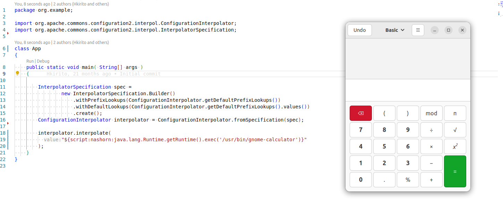

# CVE-2022-33980

NIST: https://nvd.nist.gov/vuln/detail/CVE-2022-33980<br>
PoC impl: https://github.com/HKirito/CVE-2022-33980

Библиотека `apache-commons-configuration` позволяет интерполировать конфиги, используя разнообразные адаптеры, например, через Base64-encoding (префикс `base64`), или выполнение произвольной команды (префикс `script`).

пример:

```java
interpolator.interpolate("${script:nashorn:java.lang.Runtime.getRuntime().exec('/usr/bin/gnome-calculator')}");
```




## CodeQL

По сути уязвимостью является на сама возможность выполнять произвольные скрипты в процессе интерполяции (это фича библиотеки), а то что script-адаптер был включен по умолчанию.

Кроме того, сама реализация этого адаптера находится в другой библиотеке, от которой зависит `apache-common-configuration`: `apache-common-text`.

Конкретнее, библиотека просто делегирует вызовы с префиксом `script` в `apache-common-text` (src/main/java/org/apache/commons/configuration2/interpol/DefaultLookups.java:142), в методе `lookup` уже и происходит вызов ScriptEngine из пакета `java.javax`. Поэтому кажется логичным проверить достижимость `java.javax.ScriptEngine#eval` из вывзовов `lookup` адаптеров

Реализуем CodeQL-запрос, который находит в графе вызовов вызов `eval` из `lookup`:


1. Определим кастомный тип (определение метода), с именем `lookup`, определенный на `ScriptStringLookup`:

   ```java
   class Source extends Method {
     Source() {
       getName() = "lookup"
       and getCompilationUnit().toString() = "ScriptStringLookup"
     }
   }
   ```

2. То же самое для синка (`ScriptEngine.eval`):

   ```java
   class Sink extends Method {
     Sink() {
       getName() = "eval"
       and getCompilationUnit().toString() = "ScriptEngine"
     }
   }
   ```

3. Используем предикат `calls`, чтобы проверить, что `source` вызывает `sink`:

   ```java
   from Sink sink, Source source
   where source.calls(sink)
   select
     sink, source, "Found a path from start to target."
   ```

Все вместе:

```java
/**
 * This is an automatically generated file
 * @name Hello world
 * @kind problem
 * @problem.severity warning
 * @id java/example/hello-world
 */

import java

class Source extends Method {
  Source() {
    getName() = "lookup"
    and getCompilationUnit().toString() = "ScriptStringLookup"
  }
}

class Sink extends Method {
  Sink() {
    getName() = "eval"
    and getCompilationUnit().toString() = "ScriptEngine"
  }
}

query predicate edges(Method a, Method b) { a.calls(b) }

from Sink sink, Source source
where source.calls(sink)
select
  sink, source, "Found a path from start to target."
```


## Semgrep

Добавим semgrep-правило, использующее taint analysis, которое проверяет вызов `ScriptEngine#eval` в контексте метода `lookup`:

```yaml
rules:
  - id: java-side-effectful-interpolation
    mode: taint
    pattern-sources:
      - patterns:
        - pattern-inside: |
            public String lookup($X) {
              ...
            }
    pattern-sinks:
      - pattern: |
          ScriptEngine $S = $D;
          ...
          $S.eval($X);

    message: Test
    languages:
      - java
    severity: WARNING
```

вывод:

```
┌────────────────┐
│ 1 Code Finding │
└────────────────┘

    src/main/java/org/apache/commons/text/lookup/ScriptStringLookup.java
    ❯❱ java-side-effectful-interpolation
          Test

           82┆ final ScriptEngine scriptEngine = new ScriptEngineManager().getEngineByName(engineName);
           83┆ if (scriptEngine == null) {
           84┆     throw new IllegalArgumentException("No script engine named " + engineName);
           85┆ }
           86┆ return Objects.toString(scriptEngine.eval(script), null);


┌──────────────┐
│ Scan Summary │
└──────────────┘
Some files were skipped or only partially analyzed.
  Scan was limited to files tracked by git.
  Scan skipped: 94 files matching .semgrepignore patterns
  For a full list of skipped files, run semgrep with the --verbose flag.

Ran 1 rule on 107 files: 1 finding.

⏫  A new version of Semgrep is available. See https://semgrep.dev/docs/upgrading
```

```bash
semgrep scan --config docs/semgrep.yml
```

## Joern

Для проверки кода с помощью joern также используется taint analysis. Опять же, нас интересуют ситуации когда агрумента метода `lookup` адаптеры вызывает `ScriptEngine#eval`.

1. Импортируем CPG:

   ```scala
   importCode(".")
   ```

2. Определим source и sink:

   ```scala
   def source = cpg.method.name("lookup").parameter
   def sink = cpg.call.name("eval").argument
   ```

  указываем, что нас интересуют параметры метода `lookup`, которые могут в том или ином виде появиться в качества аргументов вызова `eval`.

3. Используем `reachableByFlows`

   ```scala
   sink.reachableByFlows(source).p
   ```

joern выдает несколько эквивалентных результатов, которые отличаются только конкретным code flow. Например:

```
┌─────────────────┬──────────────────────────────────────────────────┬────┬──────┬───────────────────────────────────────────────────────────────────────────────────────────┐
│nodeType         │tracked                                           │line│method│file                                                                                       │
├─────────────────┼──────────────────────────────────────────────────┼────┼──────┼───────────────────────────────────────────────────────────────────────────────────────────┤
│MethodParameterIn│lookup(this, java.lang.String key)                │69  │lookup│/tmp/jimple2cpg-2989635559924373113/org/apache/commons/text/lookup/ScriptStringLookup.class│
│Identifier       │key != null                                       │70  │lookup│/tmp/jimple2cpg-2989635559924373113/org/apache/commons/text/lookup/ScriptStringLookup.class│
│Identifier       │key.split($stack7, 2)                             │73  │lookup│/tmp/jimple2cpg-2989635559924373113/org/apache/commons/text/lookup/ScriptStringLookup.class│
│Call             │key.split($stack7, 2)                             │73  │lookup│/tmp/jimple2cpg-2989635559924373113/org/apache/commons/text/lookup/ScriptStringLookup.class│
│Identifier       │keys = key.split($stack7, 2)                      │73  │lookup│/tmp/jimple2cpg-2989635559924373113/org/apache/commons/text/lookup/ScriptStringLookup.class│
│Identifier       │lengthof keys                                     │74  │lookup│/tmp/jimple2cpg-2989635559924373113/org/apache/commons/text/lookup/ScriptStringLookup.class│
│Call             │engineName = keys[0]                              │79  │lookup│/tmp/jimple2cpg-2989635559924373113/org/apache/commons/text/lookup/ScriptStringLookup.class│
│Identifier       │engineName = keys[0]                              │79  │lookup│/tmp/jimple2cpg-2989635559924373113/org/apache/commons/text/lookup/ScriptStringLookup.class│
│Identifier       │$stack9.getEngineByName(engineName)               │82  │lookup│/tmp/jimple2cpg-2989635559924373113/org/apache/commons/text/lookup/ScriptStringLookup.class│
│Identifier       │$stack9.getEngineByName(engineName)               │82  │lookup│/tmp/jimple2cpg-2989635559924373113/org/apache/commons/text/lookup/ScriptStringLookup.class│
│Call             │$stack9.getEngineByName(engineName)               │82  │lookup│/tmp/jimple2cpg-2989635559924373113/org/apache/commons/text/lookup/ScriptStringLookup.class│
│Identifier       │scriptEngine = $stack9.getEngineByName(engineName)│82  │lookup│/tmp/jimple2cpg-2989635559924373113/org/apache/commons/text/lookup/ScriptStringLookup.class│
│Identifier       │scriptEngine != null                              │83  │lookup│/tmp/jimple2cpg-2989635559924373113/org/apache/commons/text/lookup/ScriptStringLookup.class│
│Identifier       │scriptEngine.eval(script)                         │86  │lookup│/tmp/jimple2cpg-2989635559924373113/org/apache/commons/text/lookup/ScriptStringLookup.class│
```
в целом это ожидаемо, т.к. внутри `lookup` действительно есть несколько путей до `eval`. Об этом же пишется и в https://jaiverma.github.io/blog/joern-intro

