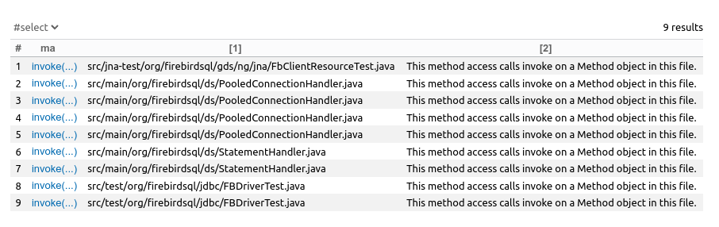

## Задание 5

org.firebirdsql.jdbc:jaybird-jdk16 2.2.15 https://github.com/FirebirdSQL/jaybird

Commit ref 888a2c0459b1caf04e670e0dd123c37c5533adcd

Используемые CodeQL-запросы:

1. Поиск вызова "опасных" методов из через DataFlow

```java
class Source extends DataFlow::Node {
    Source() {
      exists(Method m, Parameter p |
        this.asParameter() = p and
        p.getType() instanceof TypeString and
        p.getCallable() = m and
        m.isPublic()
      )
    }
}

class Source extends DataFlow::Node {
  Source() {
    exists(Method m, Parameter p |
      this.asParameter() = p and
      p.getType() instanceof TypeString and
      p.getCallable() = m and
      m.isPublic()
    )
  }
}

  // Определение приемника данных
  class Sink extends DataFlow::Node {
    Sink() {
      exists(MethodAccess ma, RefType methodType |
        // 1-ый вариант
        ma.getMethod() instanceof DangerousMethod
        // 2-ой вариант
        // methodType.hasQualifiedName("java.lang.reflect", "Method") and
        // ma.getMethod().getName() = "invoke" and
        // ma.getQualifier().getType() = methodType and
        // this.asExpr() = ma
      )
    }
  }

 module MyFlowConfig implements DataFlow::ConfigSig {
     predicate isSource(DataFlow::Node source) {
         source instanceof Source
     }

     predicate isSink(DataFlow::Node sink) {
         sink instanceof Sink
     }
 }

 module MyFlow = TaintTracking::Global<MyFlowConfig>;
 import MyFlow::PathGraph

 from MyFlow::PathNode source, MyFlow::PathNode sink
 where MyFlow::flowPath(source, sink)
 select sink.getNode(), source, sink,
     "Source: " + source.getNode().asParameter().getCallable().getDeclaringType() + "." + source.getNode().asParameter().getCallable()
```

2. Поиск `java.lang.reflect.Method.invoke`

```java
import java

from MethodAccess ma, RefType methodType
where
  methodType.hasQualifiedName("java.lang.reflect", "Method") and
  ma.getMethod().getName() = "invoke" and
  ma.getQualifier().getType() = methodType
select ma, ma.getFile().getRelativePath(), "This method access calls invoke on a Method object in this file."

```

3. Стандартный запрос QLInspector

4. Некоторые запросы отсюда: https://github.com/advanced-security/codeql-queries/tree/main/java

Единственные более-менее интересные результаты показал только запрос из 2-ого пункта.



Все эти методы реализуют проверку корректности переданного имени метода, который надо вызвать:

```java
    public Object invoke(Object proxy, Method method, Object[] args) throws Throwable {
        // Methods from object
        if (method.equals(TO_STRING)) {
            return "Proxy for " + stmt;
        } else if (method.equals(EQUALS)) {
            // Using parameter proxy (and not field) on purpose as field is nulled after closing
            return proxy == args[0];
        } else if (method.equals(HASH_CODE)) {
            // Using parameter proxy (and not field) on purpose as field is nulled after closing
            return System.identityHashCode(proxy);
        } else if (method.getDeclaringClass().equals(Object.class)) {
            // Other methods from object
            try {
                return method.invoke(stmt, args);
            } catch (InvocationTargetException e) {
                throw e.getTargetException();
            }
        } else if (method.equals(STATEMENT_IS_CLOSED) || method.equals(FIREBIRD_STATEMENT_IS_CLOSED)) {
            return isClosed();
        } else if (isClosed() && !method.equals(STATEMENT_CLOSE)) {
            throw new SQLNonTransientException("Statement is already closed",
                    SQLStateConstants.SQL_STATE_INVALID_STATEMENT_ID);
        }

        // Methods of statement and subinterfaces
        try {
            if (method.equals(STATEMENT_CLOSE)) {
                if (!isClosed()) {
                    handleClose();
                }
                return null;
            } else if (method.equals(GET_CONNECTION)) {
                // Ensure we do not leak the physical connection by returning the proxy
                return owner.getProxy();
            }
            // All other methods
            return method.invoke(stmt, args);
        } catch (InvocationTargetException ite) {
            Throwable inner = ite.getTargetException();
            if (inner instanceof SQLException se) {
                owner.statementErrorOccurred(this, se);
            }
            throw inner;
        } catch (SQLException se) {
            owner.statementErrorOccurred(this, se);
            throw se;
        }
    }
```

Сначала метод проверяется по "белому списку":

```java
    private static final Method TO_STRING = findMethod(Object.class, "toString", new Class[0]);
    private static final Method EQUALS = findMethod(Object.class, "equals", new Class[] { Object.class });
    private static final Method HASH_CODE = findMethod(Object.class, "hashCode", new Class[0]);
```

затем, после проверки, что это не метод `java.lang.Object`, идет проверка на еще один белый список. Затем метод все-таки вызывается, подразумевается, что в этом случае вызываются методы проксируемого объекта (экземпляра класса `Statement`). Например, `Statement.completeStatement`.

Метод `invoke` является публичным, поэтому, строго говоря, он часть публичного API. Однако публичный он судя по всему для того чтобы упростить взаимодействие с другими частями системы. Паттерн прокси в целом обычно так и реализуют, в том числе, насколько я знаю, и в джаве.

С другим классом примерно такая же история. Считаю, что отправлять issue не стоит
