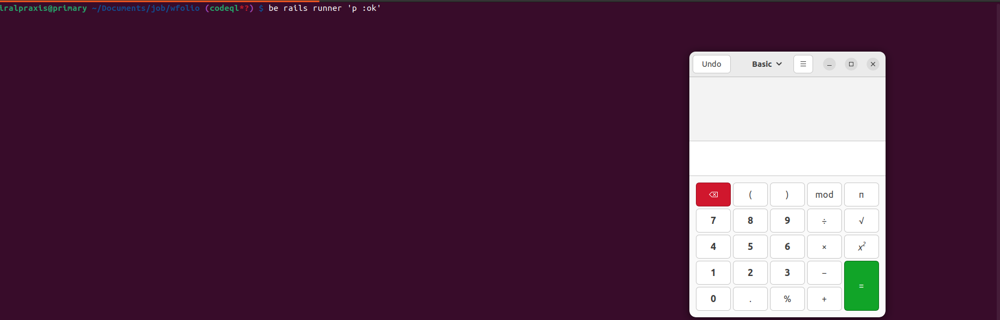

## Описание

В Ruby можно вызвать шелл двумя способами:

1. `Kernel.system("echo", "1")` / `system("echo", "1")`
2. ``echo 1`` || Kernel.`("echo 1")

Фреймворки если и используют эти методы, то как правило только для генерации темпейтов, вызова рейк-таксок и подобного


CodeQL-запрос принципиально не находит `MethodCall` с именем "`", используем  semgrep-правило:

```
rules:
  - id: backticks
    patterns:
      - pattern: "`...`"
    message: Unexpected backticks
    languages: [ruby]
    severity: WARNING
    paths:
      exclude:
        - "guides/**"
  - id: system
    patterns:
      - pattern: system(...)
    message: Unexpected system
    languages: [ruby]
    severity: WARNING
    paths:
      exclude:
        - "guides/**"
```

правило находит около 30 мест, из которых 2 в могут привести к RCE:

```
railties/lib/rails/application/configuration.rb
❯❱ backticks
      Unexpected backticks

      370┆ Rails.deprecator.warn(`config.read_encrypted_secrets is deprecated and will be removed in
            Rails 7.3.`)
        ⋮┆----------------------------------------
      374┆ Rails.deprecator.warn(`config.read_encrypted_secrets is deprecated and will be removed in
            Rails 7.3.`)
```


## Пример

Добавим файл `config.read_encrypted_secrets` куда-нибудь в $PATH:

```
touch ~/bin/config.read_encrypted_secrets
chmod +x ~/bin/config.read_encrypted_secrets
```

со следующим содержимым:

```
#!/usr/bin/env bash

gnome-calculator
```

Если rails-приложение использует API Configuration#read_encrypted_secrets, то при инициализации будет вызван этот скрипт



Проблема исправлена в этом PR: https://github.com/rails/rails/pull/51739

В followup PR один из мейнетернов пишет, что такого рода проблема потенциально могут приводить к уязвимостям: https://github.com/rails/rails/pull/51741
